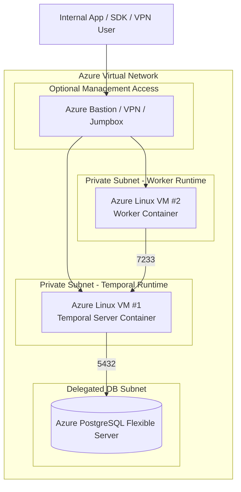
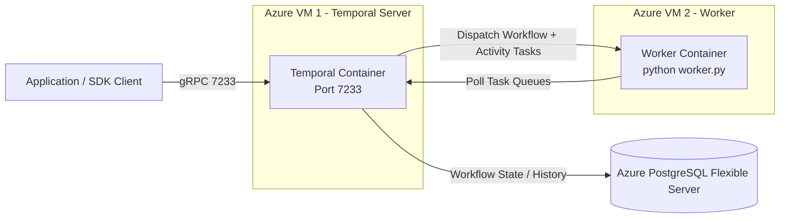
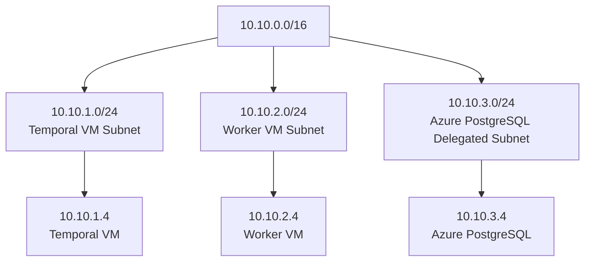
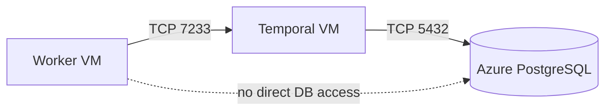
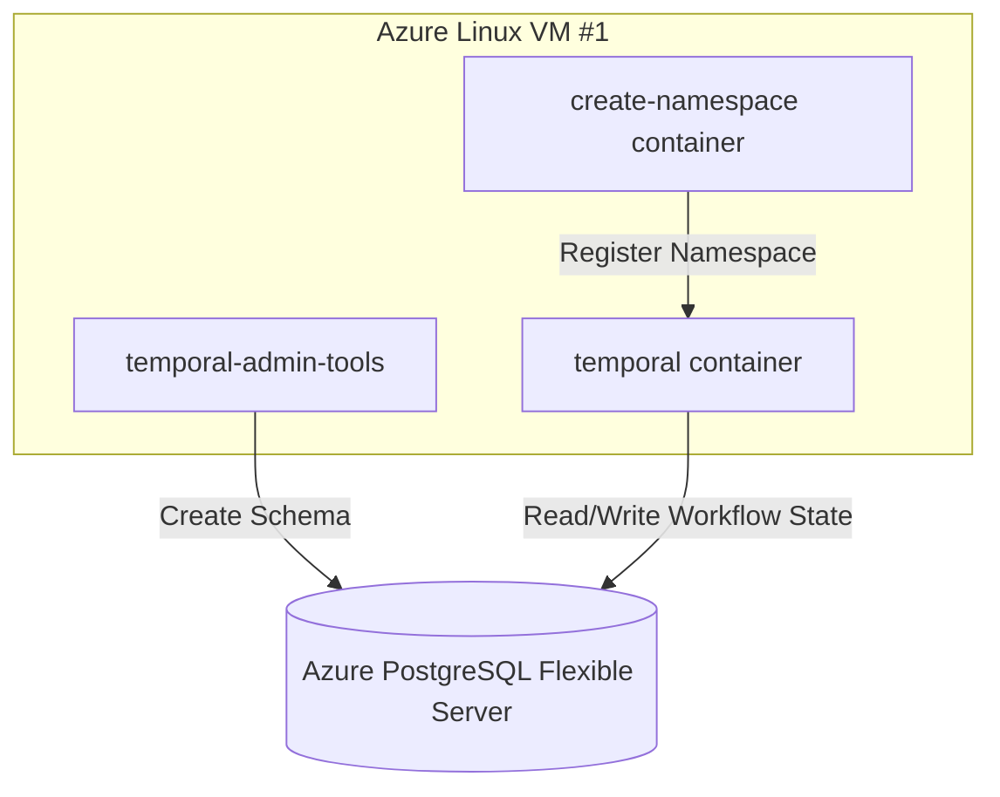
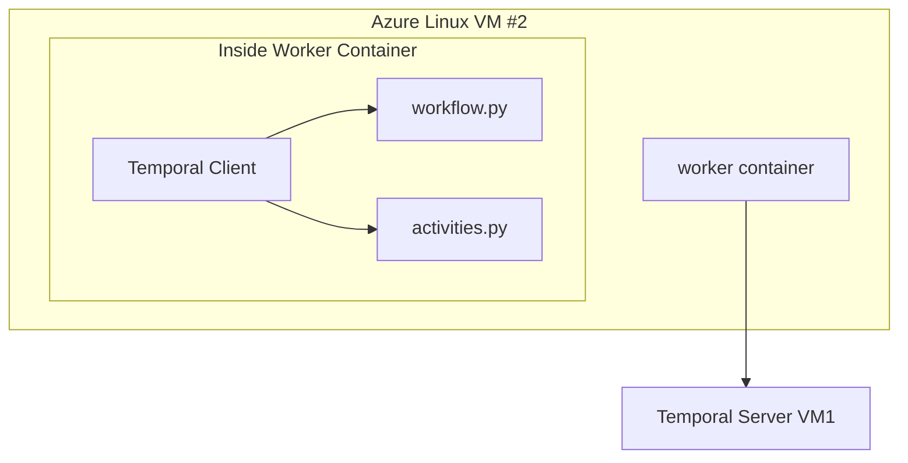
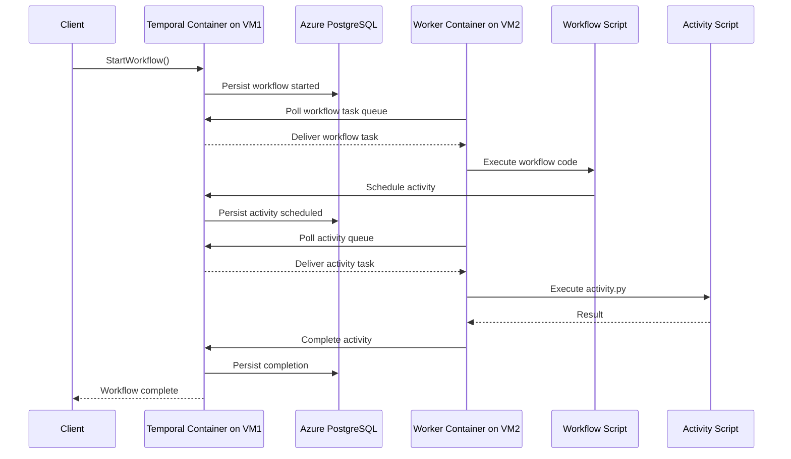
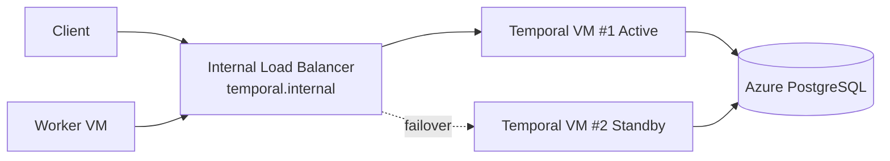

# Temporal on Azure — Two-VM Private Subnet Architecture with Azure PostgreSQL

## Objective

Refactor the local Docker Compose deployment into an Azure deployment where:

- Azure PostgreSQL Flexible Server is the durable shared state layer
- Temporal server container runs on Azure Linux VM #1
- Worker container(s) run on Azure Linux VM #2
- Both VMs reside in a private subnet
- Communication occurs only over private IPs
- Optional bastion / jump host or VPN is used for administration

---

# 1. Target Azure Architecture



---

# 2. Runtime Communication Model



---

# 3. Azure Networking Layout

Recommended VNet:

- VNet: 10.10.0.0/16
- Subnet-temporal: 10.10.1.0/24
- Subnet-worker: 10.10.2.0/24
- Subnet-postgres: 10.10.3.0/24



---

# 4. NSG Rules

## VM1 (Temporal Server VM)

Allow:
- TCP 7233 from worker subnet and client subnet
- SSH only from Bastion / VPN
- TCP 5432 outbound to Azure PostgreSQL

## VM2 (Worker VM)

Allow:
- Outbound TCP 7233 to Temporal VM
- SSH only from Bastion / VPN

## PostgreSQL Flexible Server

Allow:
- TCP 5432 inbound only from VM1 subnet



---

# 5. VM1 Container Layout

Azure Linux VM #1 hosts only Temporal server-related containers.



Example docker-compose.yml on VM1:

```yaml
services:
  temporal-admin-tools:
    image: temporalio/admin-tools:latest
    environment:
      DB: postgres12
      DB_PORT: 5432
      POSTGRES_USER: temporal
      POSTGRES_PWD: ${POSTGRES_PASSWORD}
      POSTGRES_SEEDS: mypg.postgres.database.azure.com
    volumes:
      - ./scripts:/scripts
    entrypoint: ["/bin/sh"]
    command: /scripts/setup-postgres.sh

  temporal:
    image: temporalio/server:latest
    ports:
      - "7233:7233"
    environment:
      DB: postgres12
      DB_PORT: 5432
      POSTGRES_USER: temporal
      POSTGRES_PWD: ${POSTGRES_PASSWORD}
      POSTGRES_SEEDS: mypg.postgres.database.azure.com
      BIND_ON_IP: 0.0.0.0
      DYNAMIC_CONFIG_FILE_PATH: config/dynamicconfig/development-sql.yaml
    depends_on:
      - temporal-admin-tools

  temporal-create-namespace:
    image: temporalio/admin-tools:latest
    environment:
      TEMPORAL_ADDRESS: localhost:7233
      DEFAULT_NAMESPACE: default
    depends_on:
      - temporal
```

---

# 6. VM2 Worker Container Layout

VM2 only hosts worker containers.



Example docker-compose.yml on VM2:

```yaml
services:
  payment-worker:
    build: ./worker
    container_name: payment-worker
    restart: always
    environment:
      TEMPORAL_SERVER: 10.10.1.4:7233
      TASK_QUEUE: payments
    ports: []
```

---

# 7. Workflow Execution Across Two VMs



---

# 8. Optional HA Version with Second Temporal VM

If later you want failover:



---

# 9. Recommended Azure Resources

| Resource | Purpose |
|---|---|
| Azure VNet | Private network for all components |
| Azure Linux VM #1 | Runs Temporal server containers |
| Azure Linux VM #2 | Runs worker containers |
| Azure PostgreSQL Flexible Server | Durable workflow state store |
| Azure Bastion | Secure admin access without public SSH |
| Network Security Groups | Restrict east-west traffic |
| Private DNS Zone | Resolve postgres and temporal internal names |
| Azure Key Vault | Store DB password and TLS secrets |

---

# 10. Recommended Internal DNS Names

| Component | Internal Name |
|---|---|
| Temporal Server | temporal.internal.company.local |
| PostgreSQL | postgres.internal.company.local |
| Worker VM | worker01.internal.company.local |

Then the worker container can use:

```yaml
TEMPORAL_SERVER: temporal.internal.company.local:7233
```

instead of a hardcoded IP.

---

# 11. Recommended Future Improvements

- Add second Temporal VM for failover
- Add second Worker VM for horizontal scale
- Use Azure Private Endpoint for PostgreSQL
- Store secrets in Azure Key Vault
- Use Docker systemd service for automatic startup
- Replace raw VMs with VM Scale Sets later if desired

