# Domain-Owned Temporal Runtime Platform
## Ephemeral Compute + Shared Durable State Architecture on Azure

---

# 1. Executive Summary

This platform defines a domain-owned workflow execution architecture built on Temporal and Azure PostgreSQL Flexible Server, designed for large enterprises that require:

- Strong domain isolation
- Independent ownership of workflow runtimes
- Predictable failover behavior
- Controlled infrastructure duplication
- Clear cost vs resilience trade-offs
- Secure private networking between all runtime components

The design intentionally avoids a single global Temporal cluster.

Instead, each business domain becomes an independent execution cell with:

- Its own Temporal runtime
- Its own worker pool
- Its own Azure PostgreSQL state store (or shared business-unit DB)
- Its own failover procedure and SLA

Core principle:

> Compute is disposable. State is durable. Failure is a domain-level concern.

---

# 2. Enterprise Placement Model

In a real enterprise deployment there are four logical layers:

1. Enterprise Applications
2. Workflow Integration Layer
3. Domain Runtime Cells
4. Shared Durable State Layer

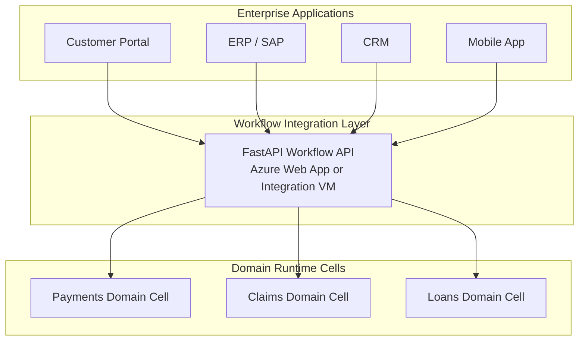

The FastAPI layer is the canonical enterprise integration boundary.

It is responsible for:

- Submitting workflows
- Monitoring workflow status
- Sending workflow signals
- Returning business-friendly status responses
- Hiding internal Temporal details from business applications

---

# 3. Recommended Azure Deployment Topology

Each domain cell is deployed using:

- One Azure Linux VM for active Temporal server container
- One Azure Linux VM for standby Temporal server container
- One or more Azure Linux VMs for workers
- Azure PostgreSQL Flexible Server
- Internal Load Balancer or Nginx gateway
- Private DNS + private subnet

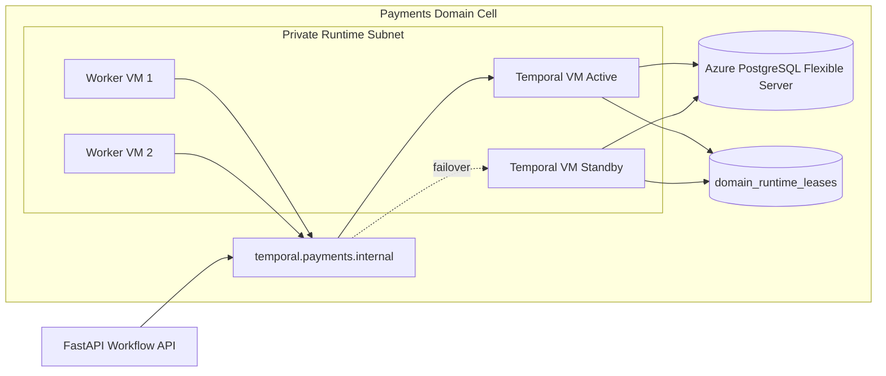

---

# 4. Networking and Private Connectivity

Recommended network layout:

- VNet: 10.10.0.0/16
- Integration subnet: 10.10.1.0/24
- Temporal subnet: 10.10.2.0/24
- Worker subnet: 10.10.3.0/24
- PostgreSQL delegated subnet: 10.10.4.0/24

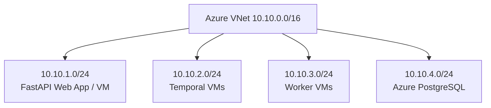

Internal DNS examples:

- temporal.payments.internal.company.local
- temporal.claims.internal.company.local
- temporal-ui.payments.internal.company.local
- postgres.payments.internal.company.local

---

# 5. Domain Runtime Cell Internal Architecture

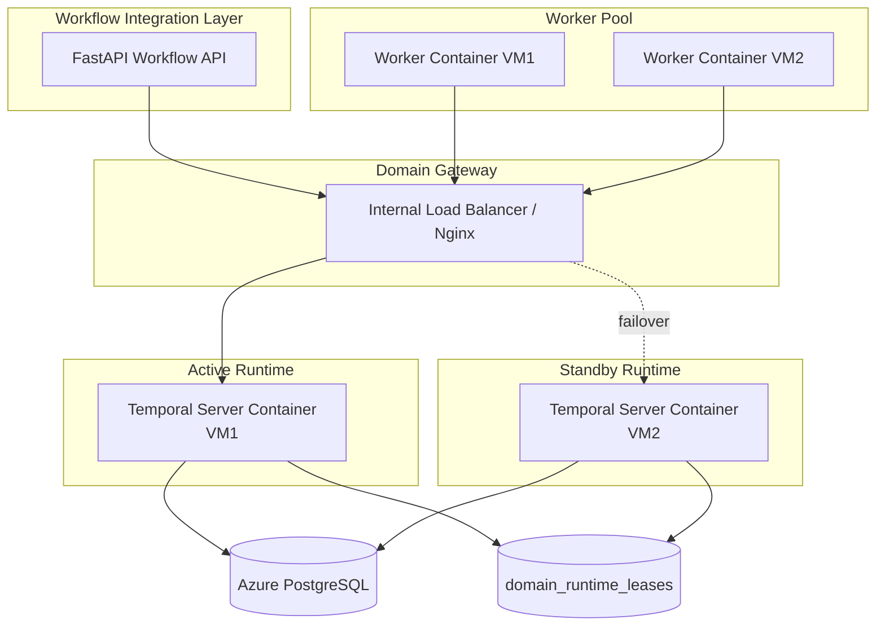

---

# 6. Worker Container and Workflow Script Communication

Each worker VM runs one or more worker containers.

Inside each worker container:

- Temporal client connects to the domain gateway
- Polls the assigned task queue
- Executes workflow code
- Executes activity code
- Returns results back to Temporal

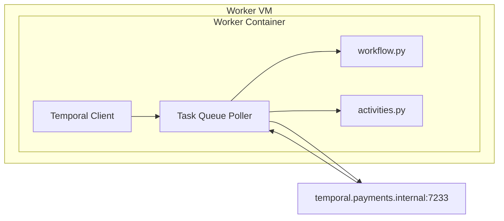

---

# 7. Workflow Submission Flow

Business applications do not connect directly to Temporal.

They submit workflows through the FastAPI integration layer.

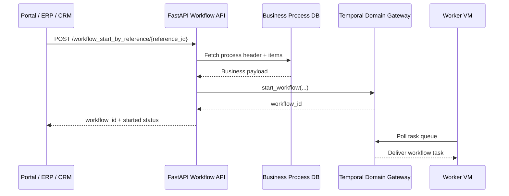

Example FastAPI connection setting:

```python
TEMPORAL_HOST = "temporal.payments.internal.company.local:7233"
```

Recommended deployment for FastAPI:

- Azure Web App with VNet Integration
- OR dedicated Integration VM in private subnet

---

# 8. Workflow Monitoring Model

Business users should receive business-friendly status.

They should not need to understand Temporal internals.

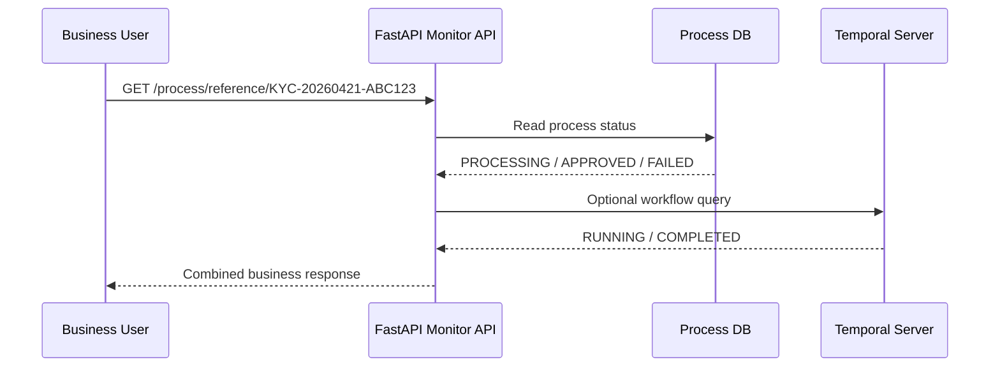

Recommended business statuses:

- SUBMITTED
- PROCESSING
- WAITING_FOR_APPROVAL
- COMPLETED
- FAILED
- REJECTED

---

# 9. Real-Time Status Updates

For richer user experience:

- Frontend starts workflow
- Receives workflow_id or reference_id
- Opens WebSocket or SignalR channel
- FastAPI pushes updates whenever DB or workflow state changes

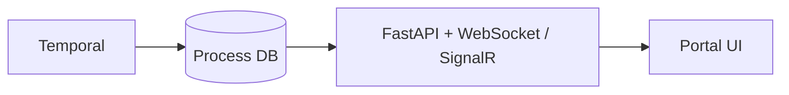

---

# 10. Temporal UI Access Model

Temporal Web UI is for operations and support teams only.

It should never be exposed publicly.

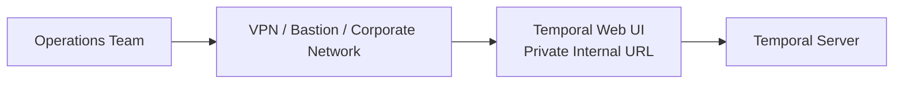

Example internal URL:

- http://temporal-ui.payments.internal.company.local:8080

Recommended deployment:

- Same VM as Temporal server
- Or separate admin VM
- Protected by VPN + SSO

---

# 11. Tiered Enterprise Deployment Model

## Tier 1 — Shared Runtime

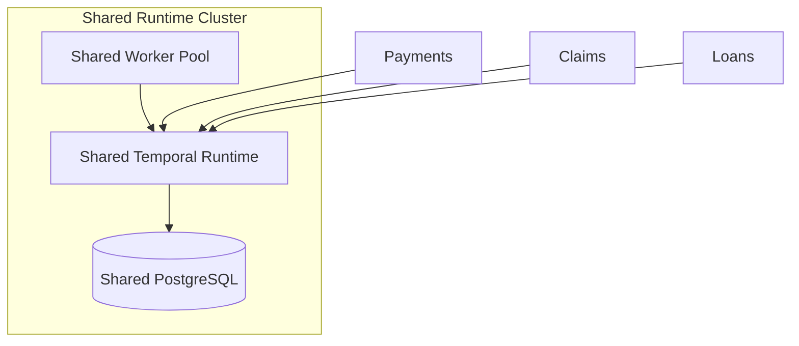

Characteristics:

- Lowest cost
- Shared infrastructure
- Logical isolation only

## Tier 2 — Semi-Isolated Business Unit Cells

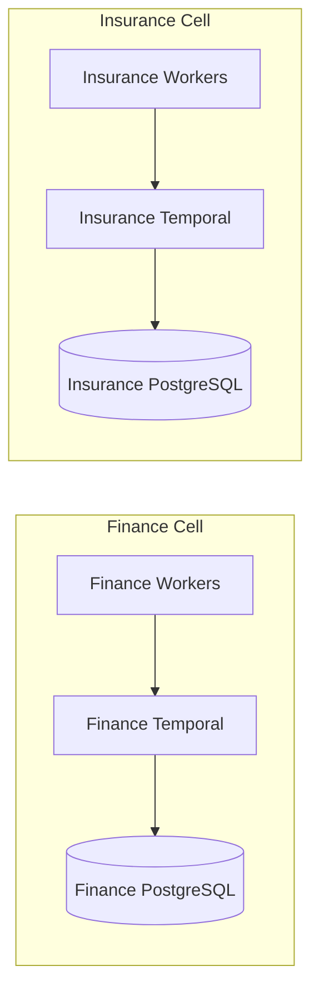

Characteristics:

- Isolation by business unit
- Separate databases per unit
- Balanced resilience and cost

## Tier 3 — Fully Isolated Domain Cells

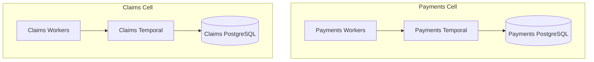

Characteristics:

- Highest isolation
- Dedicated SLA and failover per domain
- Highest infrastructure duplication

---

# 12. Failover Sequence

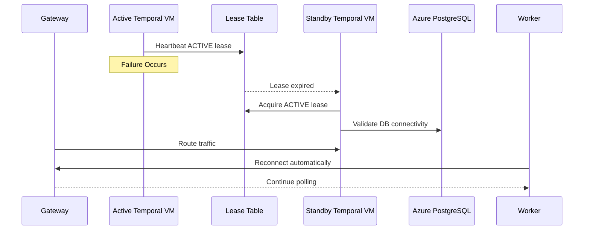

---

# 13. Lease Control Table

```sql
CREATE TABLE domain_runtime_leases (
    domain_id TEXT PRIMARY KEY,
    active_node_id TEXT NOT NULL,
    lease_status TEXT NOT NULL,
    lease_expiry TIMESTAMP,
    heartbeat_ts TIMESTAMP
);
```

Purpose:

- Prevent split-brain
- Ensure only one active Temporal server per domain
- Coordinate deterministic failover

---

# 14. Operational Separation

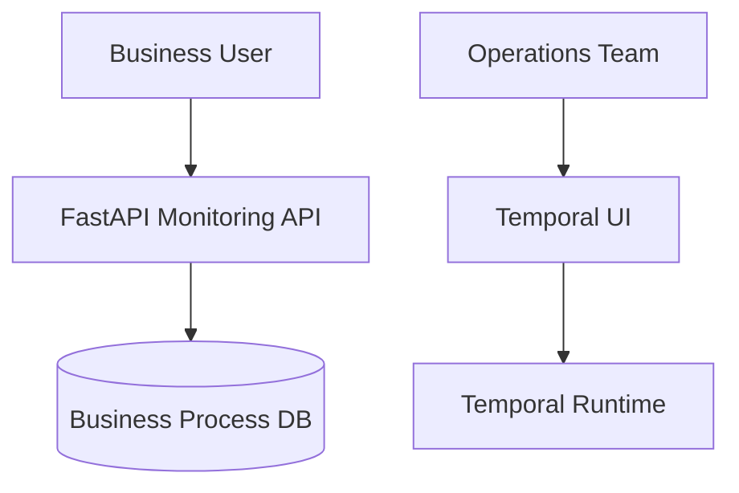

Business users consume:

- Reference IDs
- Document status
- Approval status
- Business outcome

Operations team consumes:

- Workflow history
- Activity retries
- Task queue backlog
- Failed workflow diagnostics

---

# 15. Final Enterprise Positioning

This platform enables enterprises to evolve from:

> Centralized, tightly coupled workflow infrastructure

into:

> Domain-owned, failure-isolated execution cells with predictable recovery, private connectivity, and tunable infrastructure duplication.

The architecture deliberately trades global HA complexity for:

- Stronger domain ownership
- Easier operational reasoning
- Lower blast radius
- More explicit cost control
- Better alignment with enterprise business structures


---

# 19. Azure Infrastructure Architecture — Tier 1, Tier 2, Tier 3 with Failover Design

This section defines the **physical Azure infrastructure layout**, networking boundaries, and **failover implementation mechanics** for each tier in the Domain-Owned Temporal Runtime Platform.

---

# 🟢 Tier 1 — Shared Runtime (Lowest Cost / Shared Risk Model)

## 19.1 Azure Architecture Overview

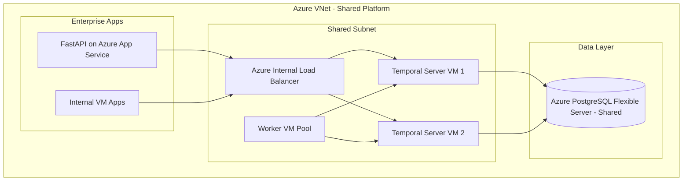

---

## 19.2 Failover Model (Tier 1)

### Failover Type: **Soft Failover (VM-based)**

| Component | Strategy |
|----------|----------|
| Temporal VM | Restart / switch active node |
| Workers | Auto-reconnect via task queue |
| DB | Managed HA (Azure PostgreSQL HA mode) |

### Failover Flow

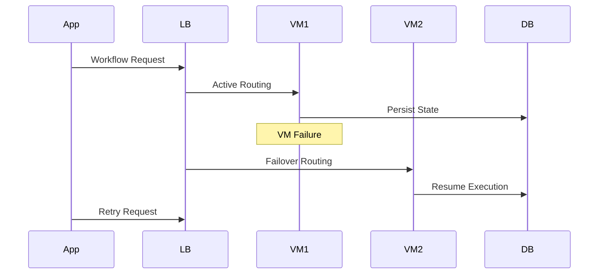

### Characteristics
- Lowest cost
- Shared blast radius
- Suitable for non-critical workflows

---

# 🟡 Tier 2 — Semi-Isolated Business Unit Cells

## 19.3 Azure Architecture Overview

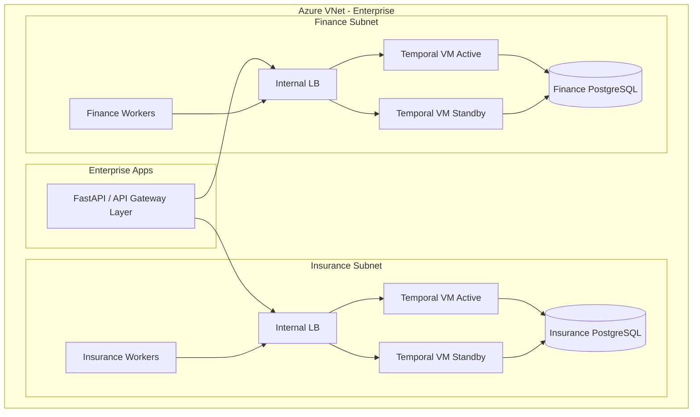

---

## 19.4 Failover Model (Tier 2)

### Failover Type: **Controlled Domain Failover**

Each business unit has independent failover.

### Flow
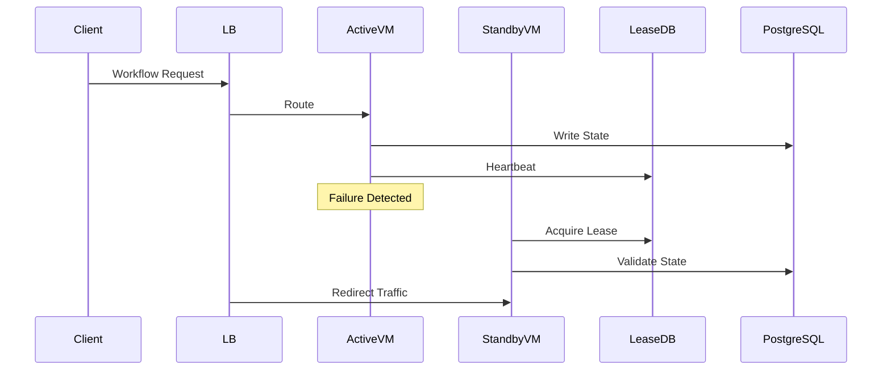

### Characteristics
- Business-unit isolation
- Independent recovery domains
- Medium cost / medium resilience

---

# 🔴 Tier 3 — Fully Isolated Domain-Owned Cells (Enterprise Critical Systems)

## 19.5 Azure Architecture Overview

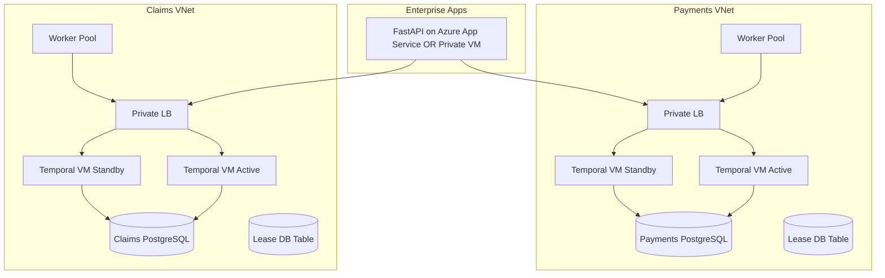

---

## 19.6 Failover Model (Tier 3)

### Failover Type: **Strict Lease-Based Leadership Election**

### Flow
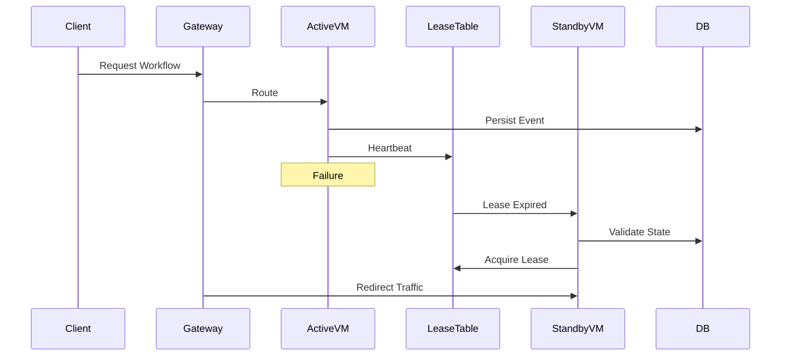

---

## 19.7 Tier 3 Key Properties

- Fully isolated domain failure zones
- No shared blast radius
- Independent scaling per domain
- Regulatory compliance friendly (banking / insurance)
- Highest cost, highest resilience

---

# 20. Cross-Tier Azure Networking Model

```mermaid
flowchart LR

    Internet --> AzureFrontDoor[Azure Front Door / WAF]

    AzureFrontDoor --> AppGateway[Application Gateway]

    AppGateway --> VNET1[Tier 1 Shared VNet]
    AppGateway --> VNET2[Tier 2 Business Unit VNet]
    AppGateway --> VNET3[Tier 3 Domain VNet]

    VNET1 --> DB1[(Shared PostgreSQL)]
    VNET2 --> DB2[(BU PostgreSQL)]
    VNET3 --> DB3[(Domain PostgreSQL)]
```

---

# 21. Enterprise Failover Design Summary

| Tier | Failover Style | RPO | RTO | Isolation |
|------|--------------|-----|-----|----------|
| Tier 1 | Soft VM failover | Medium | Medium | Low |
| Tier 2 | BU-level controlled failover | Low | Low | Medium |
| Tier 3 | Lease-based deterministic failover | Near-zero | Fastest | High |

---

# 22. Key Design Insight

Azure is used as:
- Compute substrate (VMs)
- Network isolation boundary (VNet/Subnets)
- Managed state layer (PostgreSQL HA)
- Traffic control plane (App Gateway / Load Balancer)

Temporal is NOT treated as a monolith — it is:
> A distributed domain execution fabric deployed per business isolation requirement.

