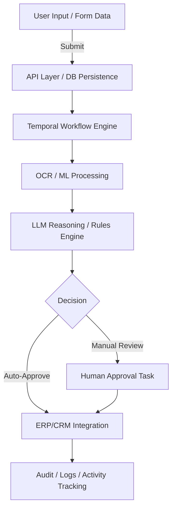
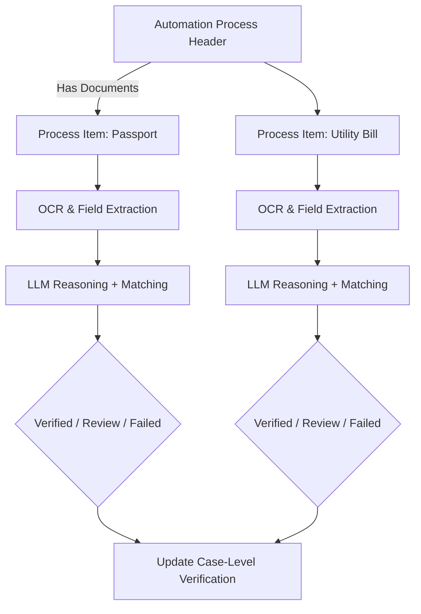
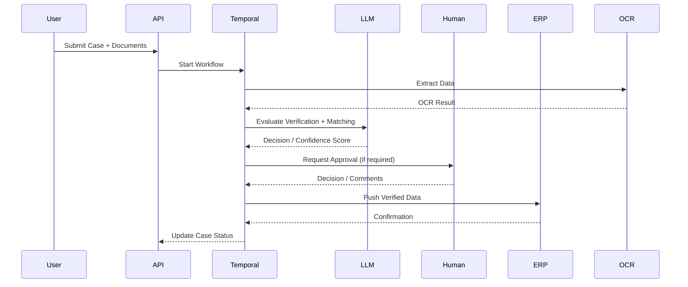

# Intelligent Business Process Automation (IBPA) Solution

This document describes a general-purpose **Intelligent Business Process Automation (IBPA)** solution using **Temporal workflows**, **AI/ML processing**, and **LLM reasoning**. It includes a **database schema** for tracking workflows, activities, documents, human approvals, and final outputs. Mermaid diagrams illustrate the architecture and workflow expansion possibilities.

---

## 1. Solution Overview

**Objective:**
Enable Fortune 500 organizations to automate structured and unstructured business processes across multiple domains (Finance, HR, Legal, Procurement) while incorporating cognitive AI reasoning and human-in-the-loop approvals.

**Key Components:**
- **User Input & Document Capture:** Structured forms + document uploads
- **OCR & Unstructured Data Processing:** Extracts fields from scanned documents
- **LLM & Rules Engine:** Performs reasoning for approvals, exception handling, and risk scoring
- **Human-in-the-Loop:** Handles escalations and approvals
- **Temporal Workflow Engine:** Manages state, retries, and orchestration
- **ERP/CRM Integration:** Pushes verified outputs

---

## 2. Database Schema

### 2.1 Workflow Instance (Top-Level Tracking)
```sql
CREATE TABLE IF NOT EXISTS workflow_instance (
    workflow_id TEXT PRIMARY KEY,
    workflow_type TEXT NOT NULL,
    status TEXT,
    input_data JSONB,
    domain TEXT,
    document_id TEXT,
    parent_workflow TEXT,
    workflow_group TEXT,
    requires_manual_review BOOLEAN DEFAULT FALSE,
    start_time TIMESTAMP DEFAULT NOW(),
    end_time TIMESTAMP,
    created_at TIMESTAMP DEFAULT NOW(),
    updated_at TIMESTAMP DEFAULT NOW()
);
```

### 2.2 Workflow Activity Log (High-Volume Logging)
```sql
CREATE TABLE IF NOT EXISTS workflow_activity_log (
    activity_log_id BIGSERIAL PRIMARY KEY,
    workflow_id TEXT NOT NULL,
    task_name TEXT NOT NULL,
    activity_type TEXT NOT NULL,
    activity_group TEXT,
    status TEXT NOT NULL,
    input_data JSONB,
    output_data JSONB,
    input_context JSONB,
    start_time TIMESTAMP,
    end_time TIMESTAMP,
    created_at TIMESTAMP DEFAULT NOW()
);
```

### 2.3 Human Approval Task
```sql
CREATE TABLE IF NOT EXISTS workflow_approval_task (
    approval_task_id BIGSERIAL PRIMARY KEY,
    workflow_id TEXT NOT NULL,
    task_name TEXT NOT NULL,
    task_type TEXT NOT NULL,
    assigned_role TEXT,
    assigned_to TEXT,
    status TEXT NOT NULL,
    decision TEXT,
    workflow_step INT DEFAULT 1,
    is_current BOOLEAN DEFAULT TRUE,
    business_key TEXT,
    priority TEXT DEFAULT 'MEDIUM',
    sla_deadline TIMESTAMP,
    escalated BOOLEAN DEFAULT FALSE,
    form_data JSONB,
    attachments JSONB,
    comments TEXT,
    created_at TIMESTAMP DEFAULT NOW(),
    completed_at TIMESTAMP
);
```

### 2.4 OCR Data (Document Ingestion)
```sql
CREATE TABLE IF NOT EXISTS workflow_ocr_data (
    document_id BIGSERIAL PRIMARY KEY,
    workflow_id TEXT NOT NULL,
    document_url TEXT NOT NULL,
    ocr_raw TEXT,
    ocr_result JSONB,
    extracted_fields JSONB,
    status TEXT DEFAULT 'NEW',
    created_at TIMESTAMP DEFAULT NOW(),
    updated_at TIMESTAMP DEFAULT NOW()
);
```

### 2.5 ERP / CRM Document Storage
```sql
CREATE TABLE IF NOT EXISTS erp_crm_documents (
    doc_id TEXT PRIMARY KEY,
    doc_type TEXT NOT NULL,
    workflow_id TEXT,
    doc_date TEXT,
    owner_name TEXT,
    reference_id TEXT,
    approval_status TEXT DEFAULT 'PENDING',
    approved_by TEXT,
    header_data JSONB NOT NULL,
    line_items JSONB,
    comments TEXT,
    created_at TIMESTAMP WITH TIME ZONE DEFAULT NOW(),
    updated_at TIMESTAMP WITH TIME ZONE DEFAULT NOW()
);
```

### 2.6 Automation Process Header (Case-Level)
```sql
CREATE TABLE IF NOT EXISTS automation_process_header (
    id BIGSERIAL PRIMARY KEY,
    reference_id TEXT,
    business_function TEXT,
    process_group TEXT,
    domain TEXT,
    declared_data JSONB,
    verification_status TEXT,
    verification_comments TEXT,
    created_at TIMESTAMP DEFAULT NOW(),
    updated_at TIMESTAMP DEFAULT NOW()
);
```

### 2.7 Automation Process Item (Document / Line Item Level)
```sql
CREATE TABLE IF NOT EXISTS automation_process_item (
    id BIGSERIAL PRIMARY KEY,
    header_id BIGINT NOT NULL REFERENCES automation_process_header(id),
    workflow_id TEXT REFERENCES workflow_instance(workflow_id),
    doc_type TEXT,
    document_id BIGINT,
    declared_data JSONB,
    matching_result BOOLEAN,
    matched_result_json JSONB,
    verification_status TEXT,
    verification_comments TEXT,
    verification_details JSONB,
    status TEXT DEFAULT 'PROCESSING',
    created_at TIMESTAMP DEFAULT NOW(),
    updated_at TIMESTAMP DEFAULT NOW()
);
```

---

## 3. Solution Architecture (Mermaid Diagrams)

### 3.1 High-Level Architecture


### 3.2 Workflow Case & Document Flow


### 3.3 Temporal Workflow Signal / Human-in-the-Loop Example


---

## 4. Key Features & Expandability

1. **Multi-Domain Support:** Finance, HR, Legal, Procurement, KYC, etc.
2. **AI + LLM Reasoning:** Cognitive decision-making with probabilistic scoring
3. **Human-in-the-loop:** Guardrails for high-risk or uncertain cases
4. **Temporal Workflows:** Long-running orchestration, retries, and auditability
5. **Document Versioning & OCR Integration:** Supports multiple document types per case
6. **ERP / CRM Output Integration:** Clean handoff to enterprise systems
7. **Activity Logging:** Complete traceability and visualization for analytics
8. **Expandable Schema:** Easily add new domains, document types, and workflow patterns

---

*This markdown file provides a blueprint for implementing a scalable, intelligent business process automation platform using modern cognitive AI, LLM reasoning, and Temporal workflow orchestration.*

