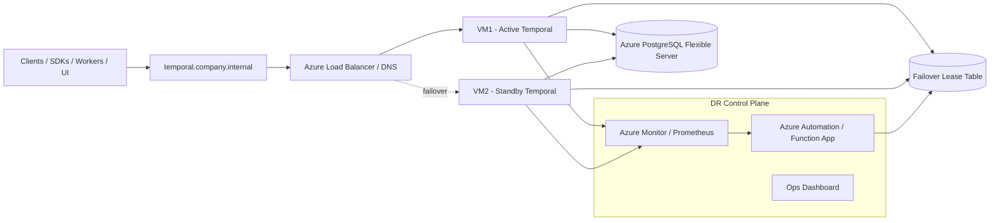
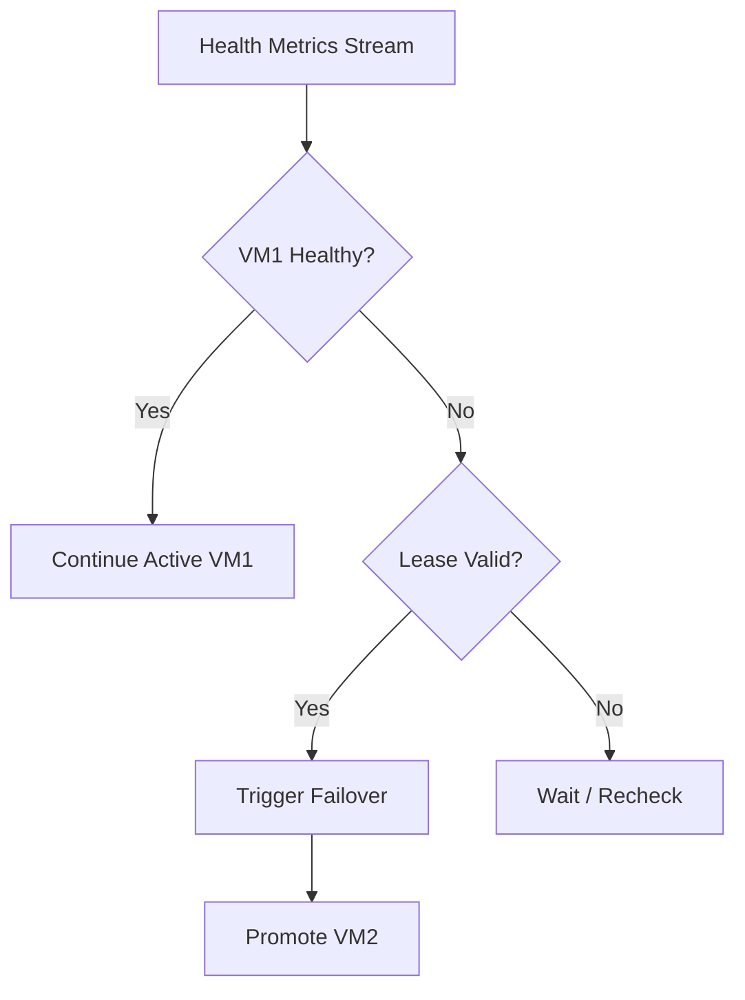
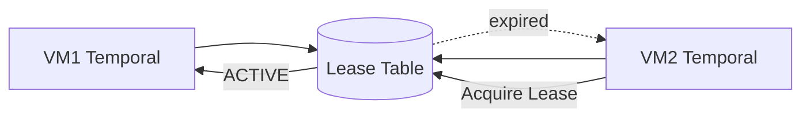
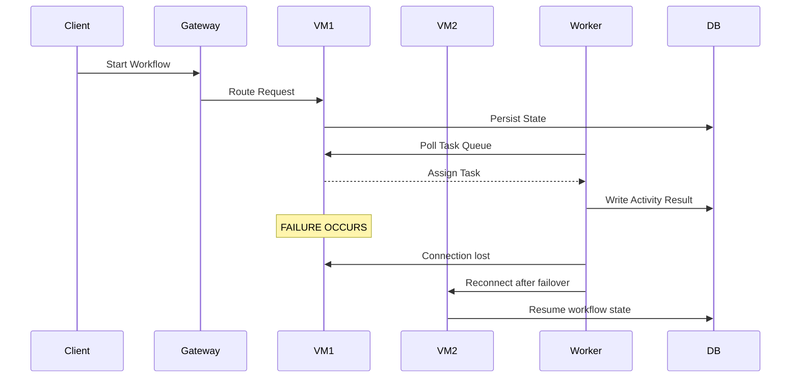
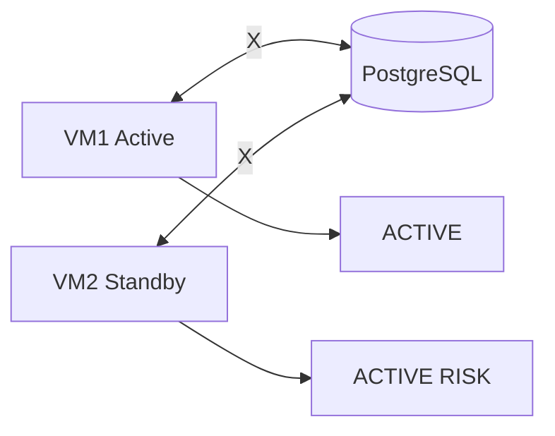
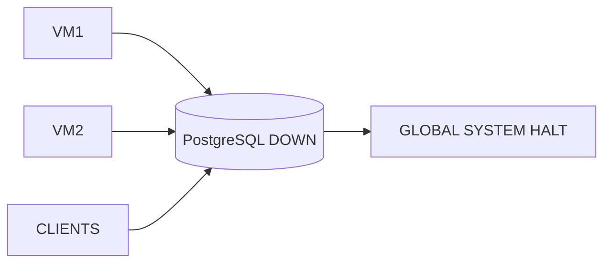
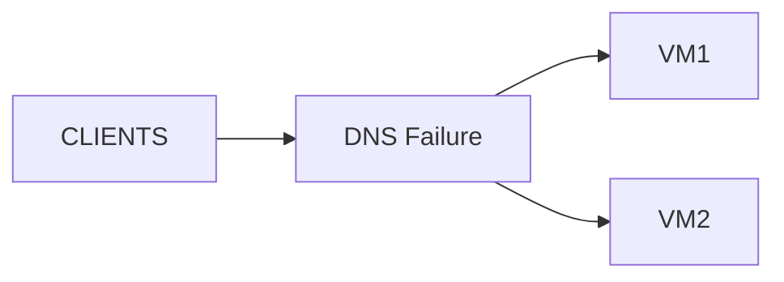
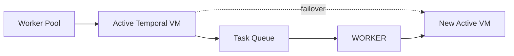

# 🔥 Temporal Azure Production DR Suite
## Enterprise-Grade Disaster Recovery Architecture for Temporal on Azure

---

# 1. Executive Summary

The Temporal Azure Production DR Suite defines a multi-layer disaster recovery architecture for self-hosted Temporal running on Azure.

It introduces:

- Control Plane (Failover Decision System)
- Active-Passive Temporal Runtime Model
- Automated + Manual Failover Modes
- Multi-tier DR strategy (Tier 1 / Tier 2 / Tier 3)
- PostgreSQL as immutable system-of-record
- Event-driven failover triggers (Azure Monitor / Prometheus)
- Runbook + automation hybrid recovery model

---

# 2. Target Architecture Overview

---

# 3. DR Control Plane (Core Component)

## Purpose

The Control Plane decides:

- Is VM1 healthy?
- Should failover trigger?
- Has split-brain occurred?
- Who owns the lease?

---

## Components

| Component | Role |
|----------|------|
| Azure Monitor | Health signals |
| Prometheus | Metrics ingestion |
| Azure Function | Decision engine |
| Lease Table (PostgreSQL) | Source of truth |
| Ops Dashboard | Human override |

---

## Failover Decision Flow

---

# 4. Failover Modes

## Mode 1 — Manual Failover

- Engineer executes runbook
- VM1 stopped manually
- VM2 started manually
- DNS switched manually

---

## Mode 2 — Assisted Failover

- Azure Monitor triggers alert
- Azure Function proposes failover
- Human approval required

---

## Mode 3 — Fully Automated Failover

- Health check failure detected
- Lease expires
- VM2 promoted automatically
- Traffic switched automatically

---

# 5. Lease-Based Leadership Model

Rules:

- Only one ACTIVE lease allowed
- Lease TTL enforced
- Heartbeat required
- Prevents split-brain

---

# 6. Runtime Execution Flow

---

# 7. Failure Scenarios

## VM Failure
- VM crash
- OS failure
- container failure

→ Failover triggered

---

## Network Partition

---

## PostgreSQL Failure

---

## DNS Failure

---

# 8. Tiered DR Strategy

## Tier 1 — Manual DR
- 2 VMs
- single PostgreSQL
- DNS switch

## Tier 2 — Hybrid DR
- Azure Monitor alerts
- Azure Function failover
- lease automation

## Tier 3 — Fully Automated DR
- auto failover
- multi-region
- SLO-based triggers

---

# 9. RTO / RPO Model

| Tier | RTO | RPO |
|------|-----|-----|
| Tier 1 | 5–15 min | 0 |
| Tier 2 | 1–3 min | 0 |
| Tier 3 | <1 min | 0 |

---

# 10. Worker Resilience Model

---

# 11. Operational Runbook

1. Confirm failure via monitoring
2. Freeze deployments
3. Fence active VM
4. Validate PostgreSQL
5. Promote standby VM
6. Switch traffic
7. Validate workers
8. Confirm workflows

---

# 12. Key Guarantees

- No split-brain (lease enforcement)
- Single source of truth (PostgreSQL)
- Stateless compute layer
- Deterministic recovery
- Controlled failover paths

---

# 13. Architecture Summary

Temporal is not running on VMs.

Temporal is running on PostgreSQL.

VMs are disposable compute nodes.

---

# 14. Future Enhancements

- Multi-region DR
- Auto failover orchestration
- Real lease service (Redis/etcd)
- Traffic Manag