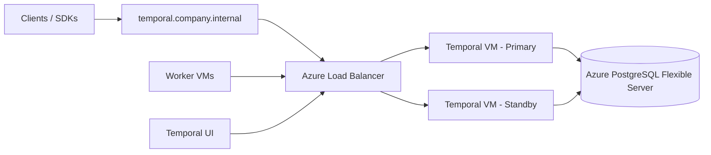
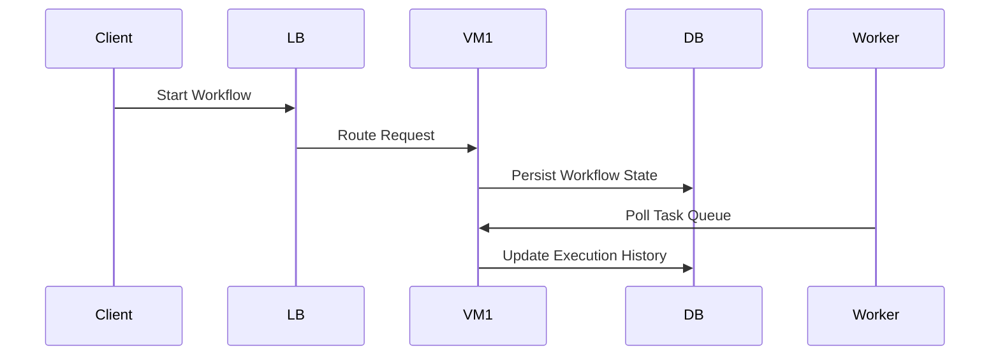
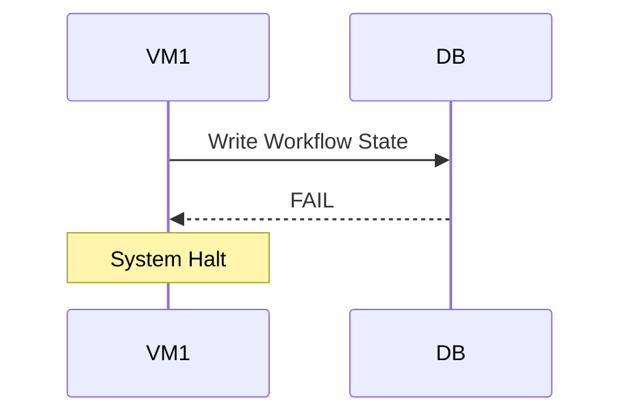
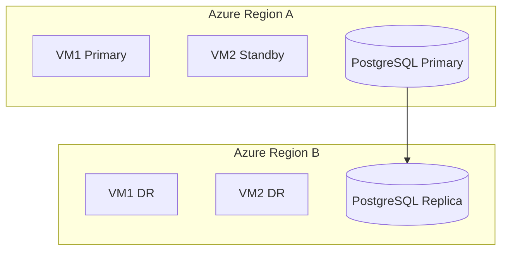

# Temporal on Azure — Disaster Recovery (DR) Solution & Runbook

## 1. Purpose

This document defines the **Disaster Recovery (DR) strategy and operational runbook** for a self-hosted Temporal deployment on Azure using:

- Two VM Temporal architecture (Primary + Standby)
- Azure PostgreSQL Flexible Server (system of record)
- Worker VMs (stateless execution layer)
- Azure DNS / Load Balancer for routing

It is intended for **cloud engineers and SRE teams** responsible for incident response and recovery operations.

---

## 2. Architecture Summary

### 2.1 High-Level DR Architecture



---

## 3. DR Principles

### 3.1 Core Principles

- Only ONE active Temporal server at any time
- PostgreSQL is the **single source of truth**
- Compute is disposable (VMs can be replaced)
- Failover is **manual and deterministic**
- Workers are stateless and auto-reconnect

---

### 3.2 Failure Domains

| Component | Impact | Severity |
|----------|--------|----------|
| VM failure | Recoverable via failover | Medium |
| Worker failure | Auto-restart | Low |
| Load Balancer failure | Routing disruption | Medium |
| PostgreSQL failure | System halt | Critical |
| Region failure | Full DR activation required | Critical |

---

## 4. Normal Operation Flow



---

## 5. Incident Detection Criteria

Declare incident if any of the following occur:

- Temporal gRPC endpoint unreachable (VM1/VM2)
- Worker polling failures > 30%
- Workflow execution backlog increasing
- PostgreSQL connection failures
- Health check failure from:

```bash
temporal operator cluster health --address <VM>:7233
```

---

## 6. Disaster Recovery Runbook (Primary Failover)

### STEP 1 — Confirm Failure

```bash
curl http://VM1:7233/health
```

or

```bash
temporal operator cluster health --address VM1:7233
```

If unhealthy → proceed.

---

### STEP 2 — Fence Primary Node (CRITICAL)

Prevent split-brain:

```bash
docker stop temporal
```

OR Azure VM shutdown

Ensure VM1 is fully inactive.

---

### STEP 3 — Validate PostgreSQL Health

```bash
psql -h <azure-postgres> -U temporal
```

Check:
- Connectivity OK
- No failover in progress
- Databases intact

---

### STEP 4 — Start Standby VM (VM2)

```bash
docker compose up -d
```

Wait for logs:

```
temporal server started
```

---

### STEP 5 — Validate Cluster Health

```bash
temporal operator cluster health --address VM2:7233
```

Expected:
- frontend: healthy
- history: healthy
- matching: healthy

---

### STEP 6 — Switch Traffic

#### Option A (Recommended): DNS Switch

Update:

```
temporal.company.internal → VM2 IP
```

TTL: 30–60 seconds

#### Option B: Azure Load Balancer
- Remove VM1
- Add VM2

---

### STEP 7 — Worker Recovery Validation

Check:

- Workers reconnect automatically
- Task queues resume
- No duplicate executions

---

### STEP 8 — Verify Workflow Continuity

```bash
temporal workflow list --namespace default --address VM2:7233
```

Ensure:
- Running workflows exist
- No missing executions

---

## 7. Failback Procedure

Used when VM1 is restored.

### STEP 1
Repair VM1

### STEP 2
Stop VM2

```bash
docker stop temporal
```

### STEP 3
Start VM1

```bash
docker compose up -d
```

### STEP 4
Switch DNS back to VM1

---

## 8. PostgreSQL Failure Scenario (Critical DR Path)

### Behavior

If PostgreSQL fails:
- BOTH VM1 and VM2 stop functioning
- System enters GLOBAL HALT



### Recovery Options
- Azure PostgreSQL HA failover
- Point-in-time restore
- Cross-region restore

---

## 9. Region-Level Disaster Recovery (Advanced)

### Architecture



### Activation Steps
1. Promote DBB
2. Start VM1B / VM2B
3. Switch DNS to Region B

---

## 10. Split-Brain Prevention Rules

NEVER:
- Run VM1 and VM2 active simultaneously
- Allow both nodes to acquire active role

Enforcement:
- Lease-based coordination (optional DB table)
- Manual fencing required during failover

---

## 11. Operational Monitoring Checklist

- Temporal frontend health
- Workflow queue backlog
- Worker heartbeat status
- PostgreSQL connection latency
- DNS resolution correctness

---

## 12. RTO / RPO Expectations

| Failure Type | RTO | RPO |
|-------------|-----|-----|
| VM Failure | 1–5 min | 0 |
| Worker Failure | 0 min | 0 |
| DNS Switch | <1 min | 0 |
| PostgreSQL Failover | 5–15 min | <1 min |
| Region DR | 15–60 min | <5 min |

---

## 13. Key Engineering Insight

Temporal reliability is NOT VM-based.

It is:

> A PostgreSQL-backed distributed workflow state machine with interchangeable compute execution nodes.

---

## 14. Summary

This DR design provides:
- Deterministic failover
- Manual control fo