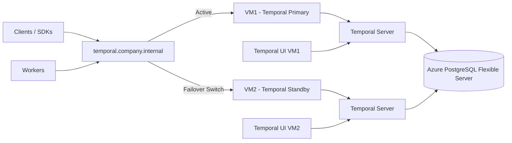

# Temporal on Azure — Two-VM Manual Failover Architecture (DR Design)

## 1. Architecture Overview

This design runs:

- VM1 (Primary Temporal Server)
- VM2 (Standby Temporal Server)
- Azure PostgreSQL Flexible Server (single source of truth)

Only ONE VM runs Temporal at a time.

Failover is manual and controlled.

---

## 2. Architecture Diagram (Mermaid)



---

## 3. Key Design Principles

### Stateless compute layer

Temporal servers contain no durable state.

### Stateful backend (Azure PostgreSQL)

Azure PostgreSQL stores:

- workflow executions
- workflow history
- namespaces
- visibility data
- task queue metadata

### Single active Temporal instance

At any moment:

```text
ONLY VM1 OR VM2 is active
```

Never both.

### Endpoint abstraction required

Clients, SDKs, workers, and UI must NOT hardcode VM IP addresses.

Always use a stable endpoint:

```text
temporal.company.internal
```

Backed by either:

- DNS record
- Azure Load Balancer
- Internal reverse proxy

---

## 4. Normal Operation Flow

### Step 1 — Active system

```text
Clients → VM1 → Azure PostgreSQL
```

### Step 2 — Workers poll via VM1

```text
Workers → VM1:7233
```

### Step 3 — UI connects to VM1

```text
UI → VM1:8080
```

---

## 5. Failure Scenario

If VM1 crashes or becomes unstable, common symptoms include:

- Temporal gRPC endpoint unavailable
- SDK connection failures
- Worker polling failures
- UI inaccessible
- `temporal operator cluster health` fails

---

## 6. Manual Failover Procedure (DR Runbook)

### Step 1 — Confirm VM1 failure

From an engineer workstation:

```bash
curl http://VM1:7233/health
```

Or:

```bash
temporal operator cluster health --address VM1:7233
```

If VM1 is unhealthy, continue.

### Step 2 — Stop VM1 (Critical)

Prevent split-brain by ensuring VM1 is fully stopped:

```bash
docker stop temporal
```

Or power off / isolate VM1.

### Step 3 — Validate Azure PostgreSQL health

Ensure PostgreSQL is reachable and not itself failing:

```bash
psql -h <azure-postgres> -U temporal
```

Verify:

- login succeeds
- databases exist
- no Azure failover event is in progress

### Step 4 — Start VM2 Temporal stack

On VM2:

```bash
docker compose up -d
```

Wait until logs show:

```text
temporal server started
```

### Step 5 — Validate VM2 cluster health

```bash
temporal operator cluster health --address VM2:7233
```

Expected:

- frontend healthy
- history healthy
- matching healthy

### Step 6 — Switch traffic

#### Option A — DNS switch (recommended)

Update:

```text
temporal.company.internal → VM2 IP
```

Recommended DNS TTL:

```text
30–60 seconds
```

#### Option B — Azure Load Balancer

- remove VM1 from backend pool
- add VM2 to backend pool

### Step 7 — Verify worker and client reconnection

Confirm:

- workers reconnect automatically
- SDKs reconnect
- new workflows start successfully
- existing workflows continue

### Step 8 — Post-failover validation

```bash
temporal operator namespace list --address VM2:7233
```

Then:

```bash
temporal workflow list --namespace default --address VM2:7233
```

Confirm:

- namespaces still exist
- running workflows are present
- workers continue processing tasks

---

## 7. Failback Procedure (Optional)

### Step 1

Repair VM1.

### Step 2

Stop VM2:

```bash
docker stop temporal
```

### Step 3

Restart VM1:

```bash
docker compose up -d
```

### Step 4

Switch DNS or load balancer back to VM1.

---

## 8. Critical Operational Rules

### NEVER run both VMs active simultaneously

This can create split-brain behavior such as:

- duplicate task processing
- inconsistent ownership of workflow tasks
- confusing worker routing

### NEVER change CLUSTER_NAME between VMs

Must always remain identical:

```text
temporal-cluster
```

### NEVER use different PostgreSQL databases between failover nodes

Azure PostgreSQL is the single source of truth.

---

## 9. Failure Domains Summary

| Component | Failure Impact |
|-----------|----------------|
| VM1 | Recoverable by failing over to VM2 |
| VM2 | Standby only |
| Azure PostgreSQL | Catastrophic if lost |
| DNS / Load Balancer | Critical routing dependency |

---

## 10. Why Local PostgreSQL Is Usually Not Enough

Although Temporal servers are stateless, Temporal itself is not stateless.

Temporal requires durable persistence for:

- workflow execution state
- retries
- timers
- activity completion tracking
- worker ownership and task queues
- recovery after restart

If you used only local PostgreSQL on each VM:

- failover VM would not know prior workflow state
- running workflows would be lost
- timers and retries would disappear
- in-flight activities could be duplicated or orphaned

This differs from managed services such as AWS Step Functions because AWS internally persists all workflow state for you.

For self-hosted Temporal:

> Azure PostgreSQL IS the durable state layer.

The Temporal servers are only replaceable compute shells.

---

## 11. Final Mental Model

> Temporal is not really running “on a VM”.
>
> Temporal is running “on PostgreSQL”.
>
> VMs are disposable compute nodes that can be replaced at any time.

---

## 12. Advantages and Tradeoffs

### Pros

- simple architecture
- predictable behavior
- low cost
- easy manual DR procedure
- suitable for internal platforms

### Cons

- manual failover
- short downtime during switch
- no automatic HA
- no multi-region resilience
- Azure PostgreSQL remains a critical dependency

---

## 13. Next Maturity Level

Possible future improvements:

- automated active-passive failover
- health-based failover scripts
- Azure Load Balancer integration
- worker auto-reconnect strategy
- blue-green Temporal upgrades
- PostgreSQL HA / read replica strategy

